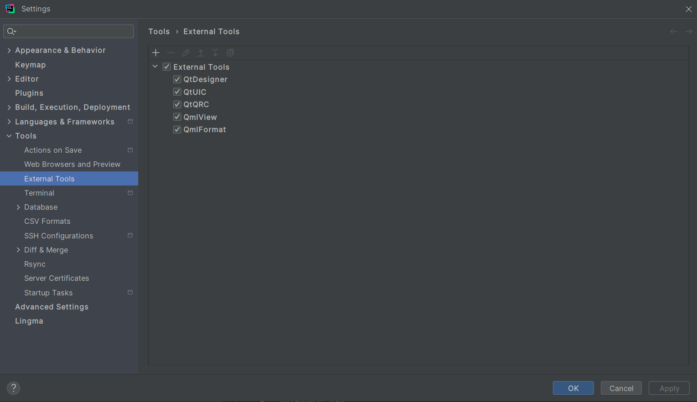

# Qt6QmlTemplateProj
* 简介：一个使用CLion、CMake编译工具链的Qt6 QML Application 的开源模板，你可以很容易构建自己的Qt应用。
> An open-source template for a Qt6 QML Application using CLion and CMake toolchain, making it easy to build your own Qt apps.

## 用法
1. 克隆这个仓库到你本地
```bash
git clone https://github.com/lsqyling/Qt6QmlTemplateProj.git
```
2. 修改项目根目录下 `CMakeLists.txt`
```cmake
cmake_minimum_required(VERSION 3.16)

project(Qt6QmlTemplateProj VERSION 1.0 LANGUAGES CXX)

set(CMAKE_CXX_STANDARD 17)
set(CMAKE_CXX_STANDARD_REQUIRED ON)

# fix your Qt path for example:
# set(CMAKE_PREFIX_PATH  xxx:/xxx/xxx/Qt/xxx/msvc2019_64)
set(CMAKE_PREFIX_PATH  D:/dev/tools/Qt/6.5.2/msvc2019_64)

```
3. 重新编译项目，就可以成功跑起来了

## 在此基础上构建你自己的应用
* 熟悉基于cmake的Q6开发工具链，你可以获得比qtcreator更好的开发体验。如果觉得不错给个star吧。
> Build your own app on this foundation. Get familiar with the Qt6 development toolchain based on CMake—enjoy a better 
development experience than Qt Creator. If you like it, give it a star!

## 提升效率的工具
1. `design.exe`
2. `uic.exe`
3. [`.qrc 文件生成工具`](https://github.com/lsqyling/Qt-qrc-creator)
4. `qml.exe`
5. `qmlformat.exe`


